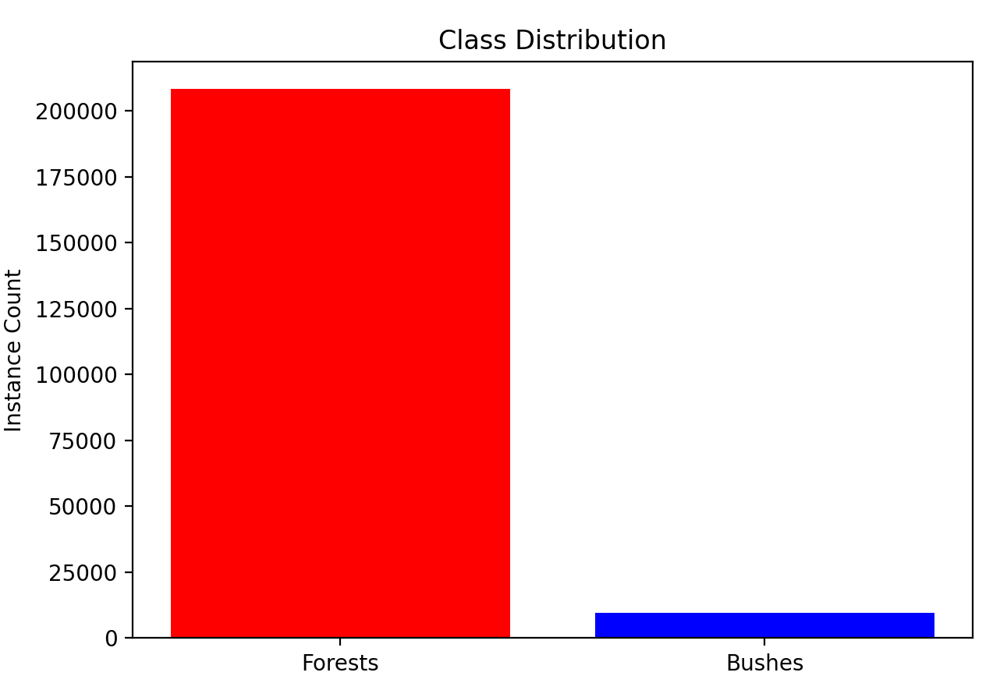

# Олешко МН (сегментація лісів)

Ціль: виділити на супутникових фото ліси та кущі.
Спосіб: YOLO v8 nano (для експериментів) та small (фінальний варіант), albumentations для аугментації.
Результат: мало чим кращі за навгад, боюсь.

[https://docs.ultralytics.com/](Ultralytics YOLO)
[https://drive.google.com/drive/folders/1MeUPRXFSmTaMKE0wkPT3b6E2jVQWMBwW](dataset)

## 1) Обрати модель

Більше ніж small (11B) я б не встигнула натренувати. Читала, що те що добре на nano в цілому переноситься на small, тому планувала nano (3B) для експериментів.

## 2) Характеристики датасету

10к розмічених супутникових фото, вже розділених на train і val, наданих ментором. Лісів разів у 20 більше, ніж кущів - проблема, бо зручного вбудованого способу компенсувати дисбаланс YOLO v8 не має. Маркування виявилось чистим, але я все одно писала код щоб вичистити ліві класи, про всяк (clean&plot.py).

## 3) Аугментація

Я вирішила врешті-решт робити тільки per-pixel зміни, щоб не доводилось міняти лейбли для аугментораних картинок, плюс YOLO робить геометричні аугментації сам. Мій код генерує кілька train_split файлів на різні кількості картинок (фінально згенерувала на підключити від 15 до 40 тис. картинок вього). Також є варіант, який аугментує рівномірно, і варіант, що надає ймовірність тільки картинкам з кущами, щоб підрівняти дисбаланс. У останньому експерименті на nano кущевий варіант дав трохи кращі результати за рівномірний, тому використано його. Для фінального тренування використано 10к додаткових зображень - достатньо, щоб кущів до лісів (instances) стало 1:4. (Файли: augment.py, bushaugment.py, evenaugment.py).
YOLO вважає, що якщо лейблу нема, картинка порожня - зручно, але через помилку у генерації шляхів більшість часу модель вважала, що всі аугментовані зображення порожні...

## 4) Підкрутка

Не здійснена - хоч в YOLO це один рядок, часу не було. З не гіпер параметрами типу к-сті картинок, cls, dropout, copy_paste та optimizer я гралась у спробі покращити статистики кущів, але це все було на кривій аугментації...

## 5) Результати

runs поки в gitignore, але можу додати. Результати однаково сумні між nano на 10 епох та small на 83... Навіть на кривх аументаціях не набагато гірше. Нижче найкращі результати - small на 83 епохи (73 нормально + 10 охолодження вручну). (Файли: train.py, trainparams copy.py - шаблон, сам trainparams локальний.)

## 6) Чистка масок

Просили спробувати зачистити маски YOLO за допомогою стандартного computer vision? Накидала приклад використання моделі в openclosetest.py - після завантаження моделі та predict, скрипт використовує open-close з opencv, щоб підчистити маску (прибрати оодинокі пікселі та згладити края).
